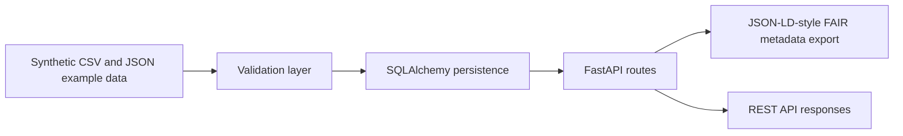

# Architecture

This prototype is a compact FastAPI service for managing a small scientific dataset with FAIR-oriented metadata. It is intentionally narrow in scope, but it is built as a complete working slice: ingest, validate, store, serve, and export.

## System Overview

The runtime flow is simple:

## Components

- `app/main.py` creates the FastAPI application, initializes the database, and registers route modules.
- `app/database.py` configures SQLAlchemy and creates tables for local runs.
- `app/models.py` defines the relational data model.
- `app/schemas.py` validates API and ingestion payloads with Pydantic.
- `app/services/ingestion.py` loads synthetic CSV and JSON example data.
- `app/services/validation.py` enforces structural rules before records are written.
- `app/services/metadata_export.py` builds a JSON-LD-style metadata export.
- `tests/` verifies validation, ingestion, API behavior, and metadata export.

## Runtime Options

The default local runtime uses SQLite through `DATABASE_URL=sqlite:///./fair_data_hub.db`.
Docker Compose runs the API with PostgreSQL to demonstrate the same application against a service database.

## Reproducibility Notes

- Example data lives in `data/` and is synthetic by design.
- The ingestion script is idempotent, so rerunning it should not duplicate records.
- The exported metadata includes provenance notes so reviewers can see that the dataset is illustrative rather than real-world operational data.

This is intentionally not a production deployment. It is a small, reviewable portfolio prototype.

